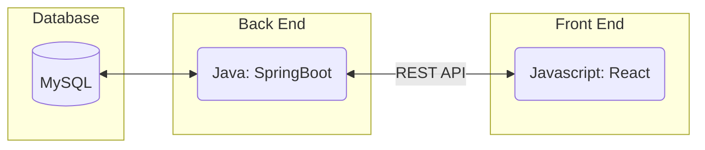
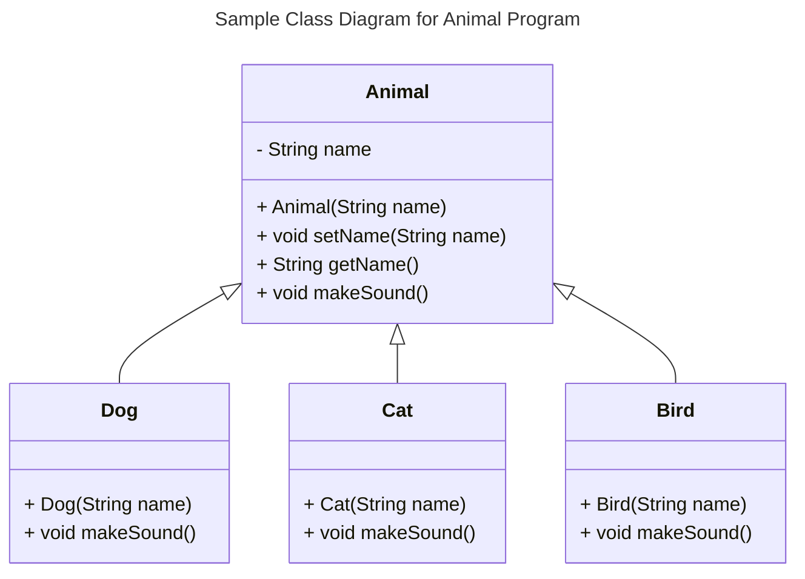
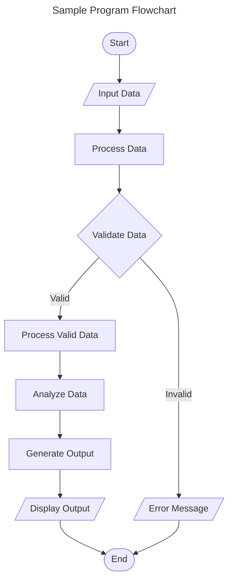
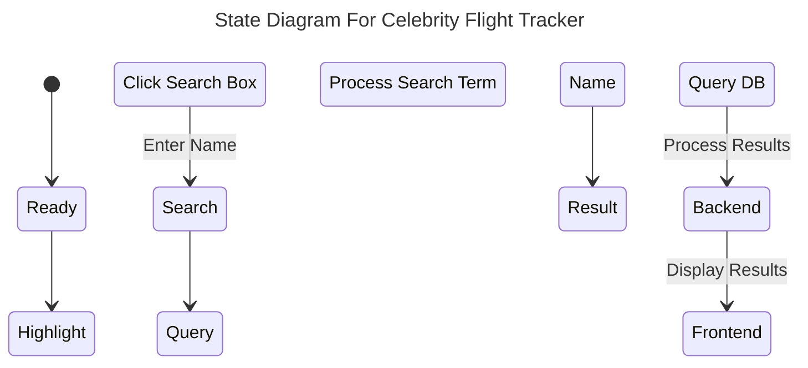

# Specification Document

<!-- Please fill out this document to reflect your team's project. This is a living document and will need to be updated regularly. You may also remove any section to its own document (e.g. a separate standards and conventions document), however you must keep the header and provide a link to that other document under the header.

Also, be sure to check out the Wiki for information on how to maintain your team's requirements.
-->
## TeamName

Team 3b 
 <!--The name of your team.-->

### Project Abstract

<!--A one paragraph summary of what the software will do.
This is an example paragraph written in markdown. You can use *italics*, **bold**, and other formatting options. You can also <u>use inline html</u> to format your text. The example sections included in this document are not necessarily all the sections you will want, and it is possible that you won't use all the one's provided. It is your responsibility to create a document that adequately conveys all the information about your project specifications and requirements.
-->
Team 3b will create a Celebrity Flight Tracker. This project will read flight logs and track relevant information pertaining to celebrities and their flights. Users will be able to look up and filter through this information with a variety of characteristics such as the name of the celebrity, airport destination/origin, travel dates and so on.

### Customer
<!--A brief description of the customer for this software, both in general (the population who might eventually use such a system) and specifically for this document (the customer(s) who informed this document). Every project will have a customer from the CS506 instructional staff. Requirements should not be derived simply from discussion among team members. Ideally your customer should not only talk to you about requirements but also be excited later in the semester to use the system.-->
The customer base for this software are those who are curious about the traveling habits or wherabouts of celebrities. The software will be available publically. 

### Specification

<!--A detailed specification of the system. UML, or other diagrams, such as finite automata, or other appropriate specification formalisms, are encouraged over natural language.-->

<!--Include sections, for example, illustrating the database architecture (with, for example, an ERD).-->

<!--Included below are some sample diagrams, including some example tech stack diagrams.-->

#### Technology Stack



#### Database
In Progress

#### Class Diagram
In Progress
<!--

-->

#### Flowchart
In Progress


#### Behavior
In Progress


#### Sequence Diagram

```mermaid
sequenceDiagram

participant ReactFrontend
participant SpringBoot
participant MySQLDatabase

ReactFrontend ->> SpringBoot: HTTP Request (e.g., GET /api/data)
activate DjangoBackend

SpringBoot ->> MySQLDatabase: Query (e.g., SELECT * FROM data_table)
activate MySQLDatabase

MySQLDatabase -->> SpringBoot: Result Set
deactivate MySQLDatabase

SpringBoot -->> ReactFrontend: JSON Response
deactivate DjangoBackend
```

### Standards & Conventions

<!--This is a link to a seperate coding conventions document / style guide-->
[Style Guide & Conventions](STYLE.md)
