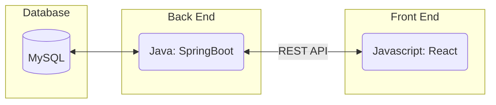

# Star Stalker

A real-time sports team flight tracker using live ADS-B flight data.

## Sprint Goal
Implement the first functional increment of the system by March 2: a working `GET /flights` endpoint in Spring Boot connected to a MySQL table, and a React UI that displays the returned results. Success is measured by demonstrating that changes in the database are visible in the frontend without manual intervention.

#### Technology Stack

## How It Works
Sports teams fly charter flights with consistent, predictable flight numbers. We poll a live ADS-B flight API to get real-time position data for each team, store it in MySQL, and serve it to the React frontend. If a team is not currently flying, the last known position is preserved.

## API
Flight data comes from the [Airplanes.live REST API](http://api.airplanes.live/v2/).

## Backend
- Scheduled job polls the flight API for each tracked team
- Stores results in MySQL
- Exposes REST endpoints for the frontend

## Frontend
- Displays current flight status for all tracked teams
- Built against mock data in `database/` until backend is ready

## Standards & Conventions
[Style Guide & Conventions](STYLE.md)